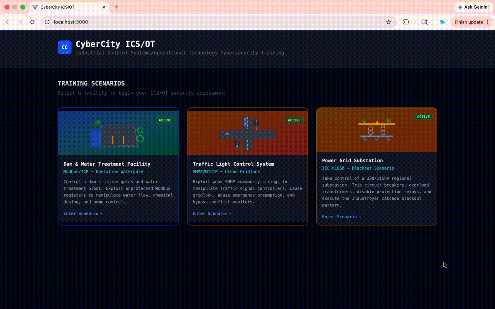

# 🏙️ CyberCity ICS/OT

Industrial Control Systems / Operational Technology (ICS/OT) Cybersecurity Training Platform.

A scenario-based training lab where students learn to assess and exploit real-world industrial control systems. Each scenario simulates a different critical infrastructure facility with live physics, real ICS/OT protocols, and visual feedback.



## 🎯 Scenarios

| # | Facility | Protocol | Port | Status |
|---|----------|----------|------|--------|
| 1 | **HydraGuard**: Dam & Water Treatment Plant | **Modbus/TCP** | 5020 | ✅ Active |
| 2 | **MetroGrid**: 4-Way Traffic Intersection | **SNMP v2c** (NTCIP) | 5021/udp | ✅ Active |
| 3 | **Northgate Substation**: 230/115kV Power Grid | **IEC 61850 MMS** | 5022 | ✅ Active |
| 4+ | **More scenarios in development** | - | - | 🔜 Coming Soon |

---

### 🌊 Scenario 1: HydraGuard (Dam & Water Treatment)
**Protocol: Modbus/TCP** · Port 5020

Modbus is the oldest and most widely deployed ICS protocol (Schneider Electric, 1979). It has **zero built-in authentication**, anyone who can reach port 502 can read or write any register. Inspired by real incidents: Bowman Avenue Dam breach (2013), Oldsmar FL water treatment (2021).

**What you can do:**
- Read holding registers to map the entire physical process
- Write coils to open dam sluice gates and flood downstream
- Spike sodium hypochlorite dosing into lethal concentrations
- Kill pumps, force overflow, disable alarms

**Attack phases:**
1. **Reconnaissance**: `mbpoll` / `modpoll` to scan and enumerate registers
2. **Eavesdropping**: Capture cleartext Modbus frames with Wireshark
3. **Register Manipulation**: Direct coil/register writes to actuate physical devices

---

### 🚦 Scenario 2: MetroGrid (4-Way Traffic Intersection)
**Protocol: SNMP v2c** (NTCIP 1202) · Port 5021/UDP

SNMP (Simple Network Management Protocol) v2c uses plaintext **community strings** for auth, effectively a shared password sent in the clear. NTCIP 1202 is the US standard OID schema for traffic controllers. A 2014 University of Michigan study found ~100 real intersections exposed with default strings (`public` / `private`).

**What you can do:**
- Walk the OID tree to discover all controller variables
- Modify phase timing to cause gridlock and queue starvation
- Trigger Emergency Vehicle Preemption (EVP) to lock a direction green
- Disable the Conflict Monitor, the safety relay that prevents opposing greens

**Attack phases:**
1. **Discovery & Enumeration**: `snmpwalk -v2c -c public` to map all OIDs
2. **Timing Manipulation**: Write phase durations to disrupt traffic flow
3. **Emergency Preemption Abuse**: Force EVP to pin one direction
4. **Conflict Monitor Bypass**: Disable safety interlock, force simultaneous greens (mirrors TRISIS/Triton 2017 SIS attack pattern)

---

### ⚡ Scenario 3: Northgate Substation (230/115kV Power Grid)
**Protocol: IEC 61850 MMS** · Port 5022

IEC 61850 is the international standard for substation automation and protection relay communication. **MMS (Manufacturing Message Specification)** is the application-layer protocol used by Intelligent Electronic Devices (IEDs) to expose data objects using a strict logical node hierarchy (`LD/LN.DO.DA`). Most legacy IEDs have no authentication. This scenario mirrors the **Industroyer / Crashoverride** attack (Ukraine, December 2016) that caused a 1-hour blackout for 230,000 people.

**What you can do:**
- Read all IED data objects: CB states, bus voltages, transformer loading, protection relay status
- Disable all 5 protection relays (differential, overcurrent, under-frequency, auto-recloser)
- Trip all 7 circuit breakers in rapid succession
- Trigger thermal overload cascade on TX2 (200MVA) once TX1 is isolated
- Achieve total blackout: 190 MW lost across Industrial, Residential, and Critical zones

**Attack phases:**
1. **Recon**: `identify` + `get_name_list` to discover all logical nodes
2. **Telemetry**: `read_dataset DS_FULL` to snapshot live measurements
3. **Selective Tripping**: Trip individual CBs to isolate transformer feeders
4. **Industroyer Pattern**: Disable all protection → rapid CB trip sequence → block auto-reclosure → permanent blackout

## 🚀 Quick Start

### Prerequisites

- **Node.js** 20+ (`brew install node`)
- **Python** 3.11+ (`brew install python@3.11`)
- **SNMP tools** for Scenario 2 (`brew install net-snmp`)

### Setup

```bash
chmod +x scripts/setup.sh
./scripts/setup.sh
```

### Run (two terminals)

**Terminal 1 (Backend):**
```bash
cd backend
source venv/bin/activate
python main.py
```

**Terminal 2 (Frontend):**
```bash
cd frontend
npm run dev
```

Open **http://localhost:3000** in your browser.

### 🐳 Run with Docker (alternative)

```bash
docker-compose up --build
```

Open **http://localhost:3000**.

## 🏗️ Architecture

```
┌─────────────────────────────────────────────────────────┐
│  🌐 Browser (localhost:3000)                            │
│  React + Konva.js + Recharts                            │
└────────────────────────┬────────────────────────────────┘
                         │ WebSocket (Socket.IO)
                         ▼
┌─────────────────────────────────────────────────────────┐
│  ⚙️  FastAPI + Socket.IO (localhost:8000)                │
│  Physics Engine · Protocol Servers · Real-time State    │
├─────────────────┬─────────────────┬─────────────────────┤
│ 🌊 Modbus/TCP   │ 🚦 SNMP Agent   │ ⚡ IEC 61850 MMS   │
│ Port 5020       │ Port 5021/udp   │ Port 5022           │
│ Dam & Treatment │ Traffic Control │ Power Substation    │
└─────────────────┴─────────────────┴─────────────────────┘
        ▲                 ▲                  ▲
        │                 │                  │
   mbpoll/modpoll    snmpwalk/snmpset   IEC 61850 client
   (Student attacks with standard ICS/OT tooling)
```

---

*This project is under active development. New scenarios and features are being added regularly.*
